# stmledger

Small Ledger Application.

## Getting Started

This project is using SQL Database for small business POS app.
## Features
- Add new product with random Image
- Custom search between from date and to date with product name in warehouse UI and summary UI
- Easy to use for selling and printing
- Search voucher day by day

# 390-844 1180-820
## Screenshot
## Large Screen
- Category (Large Size)
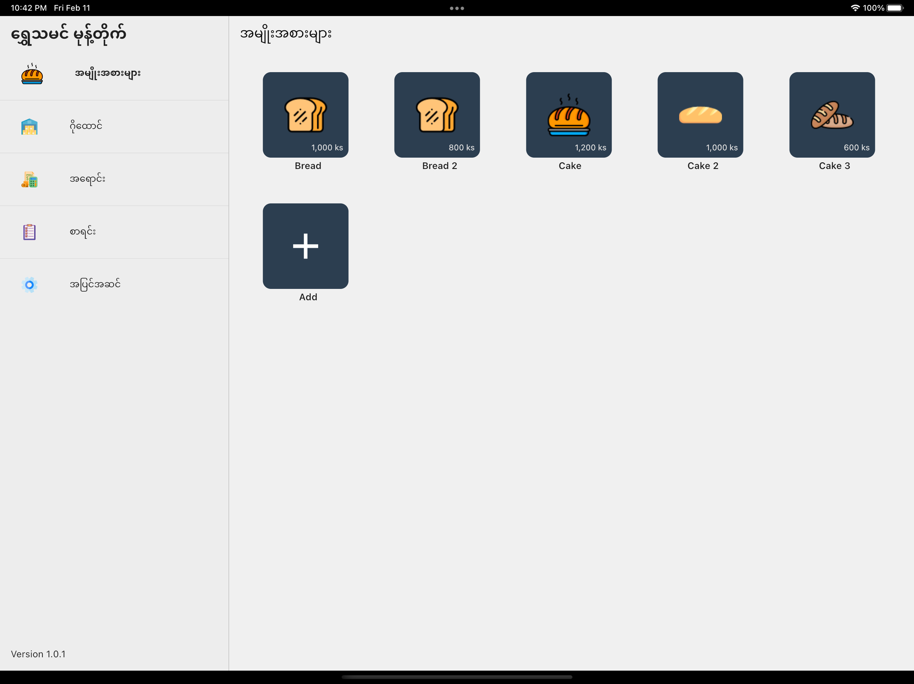
- Warehouse (Large Size)
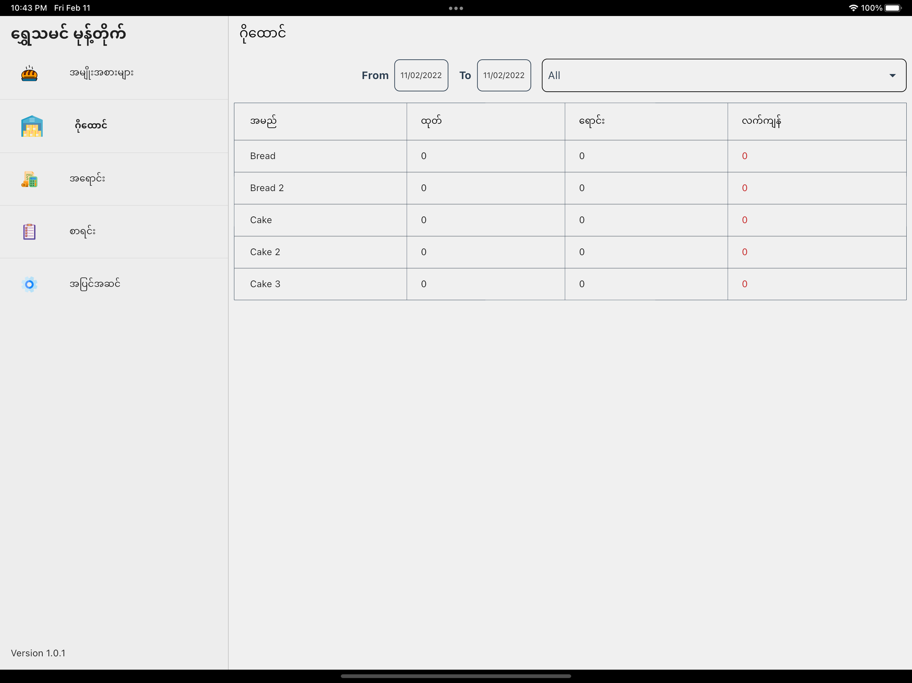
- Sale add to cart (Large Size)
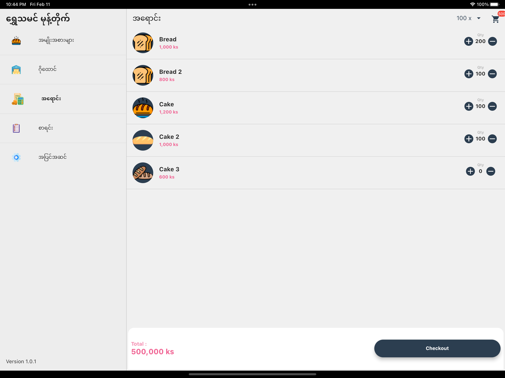
- Sale voucher (Large Size)

- Sale cart (Large Size)
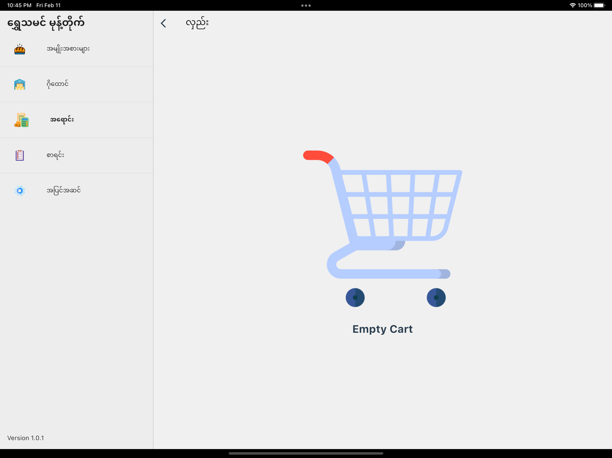
- Summary (Large Size)
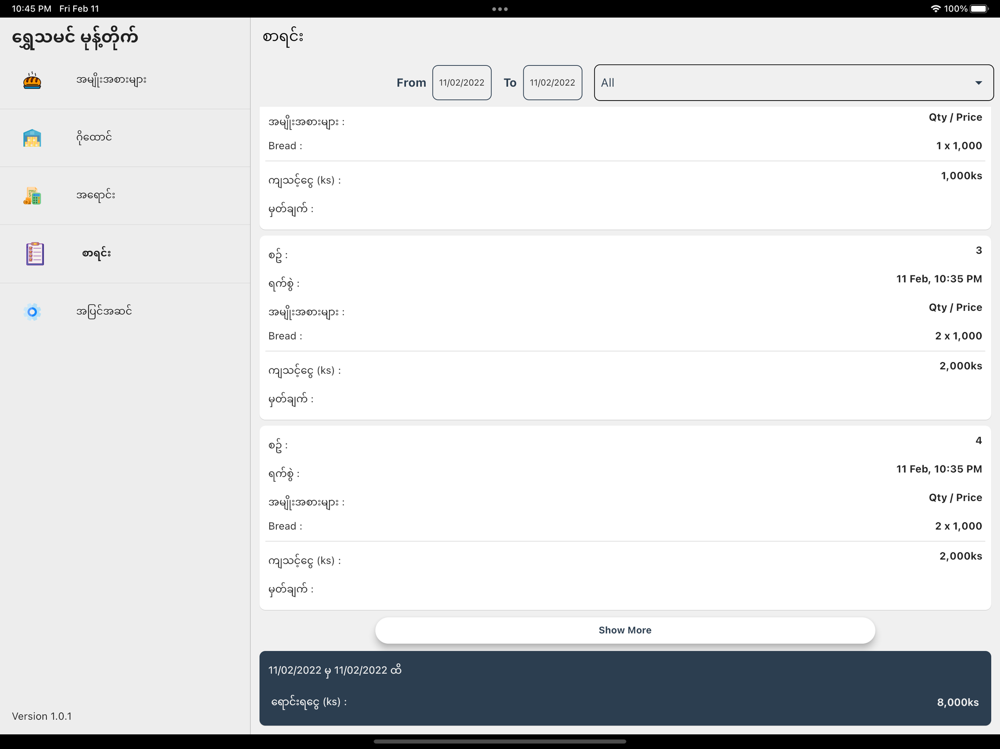
- Setting (Large Size)
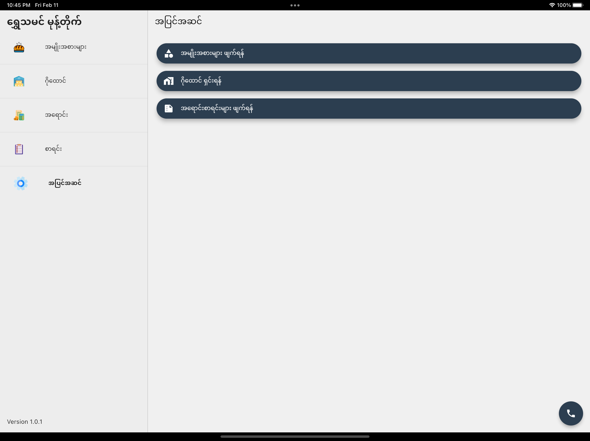

## Small Screen
- Home (Phone Size)
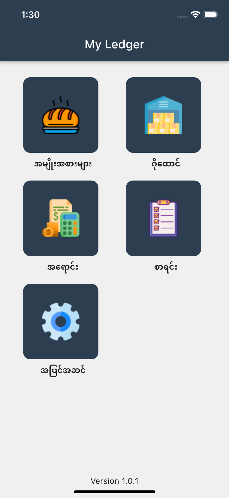
- Add Product (Phone Size)
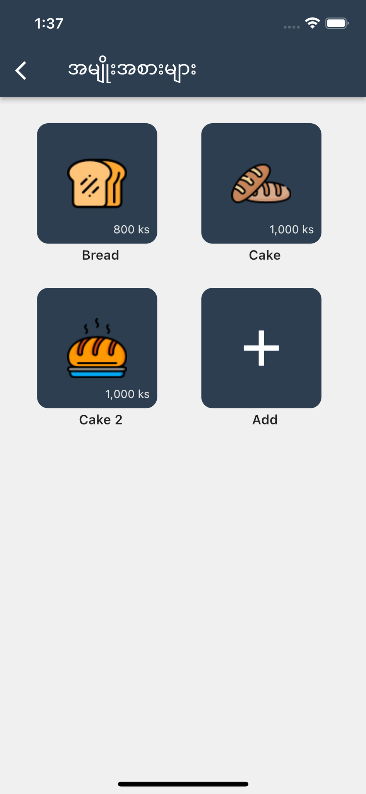
- Warehouse (Phone Size)
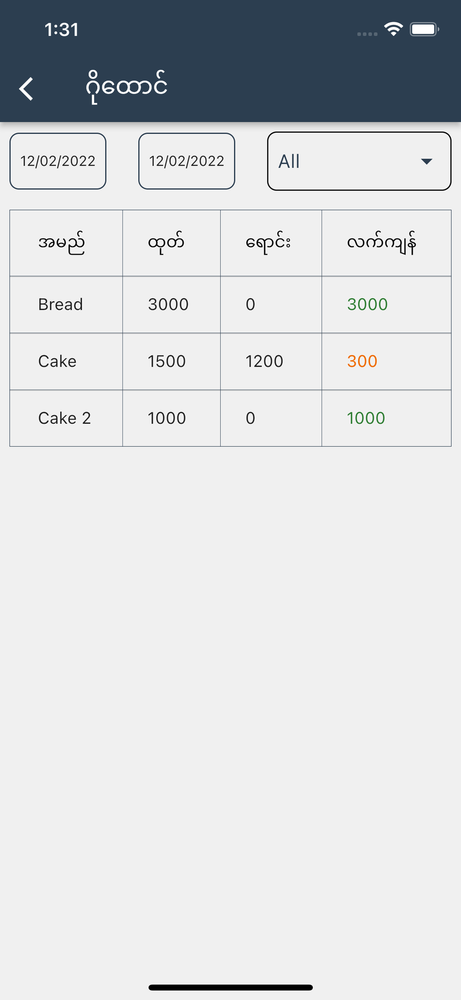
- Sale (Phone Size)
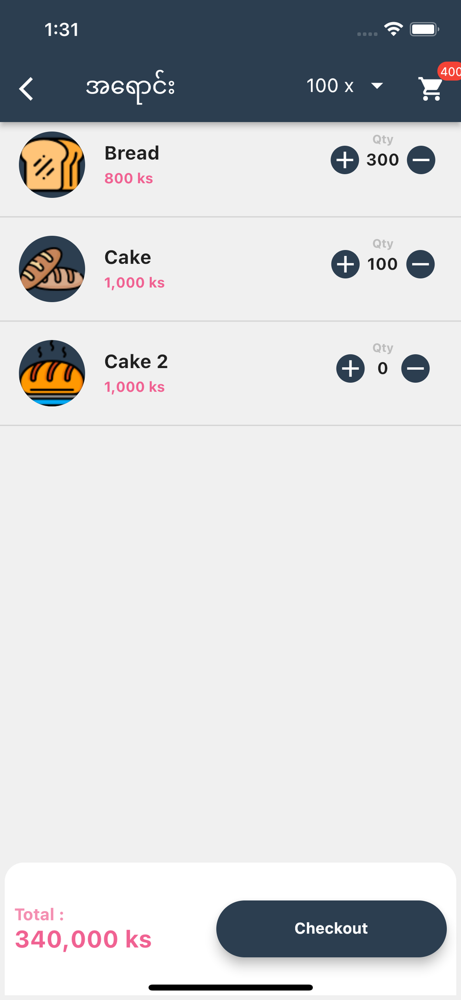
- Voucher (Phone Size)
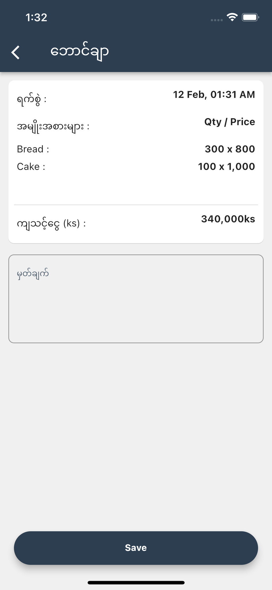
- Summary (Phone Size)
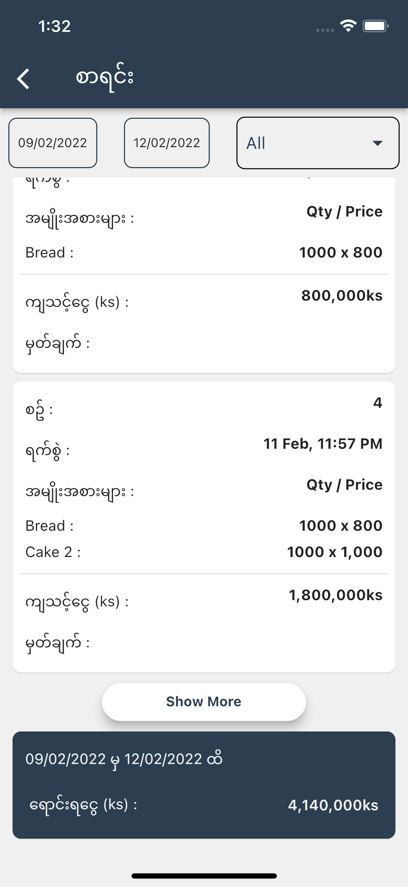
- Summary Print (Phone Size)
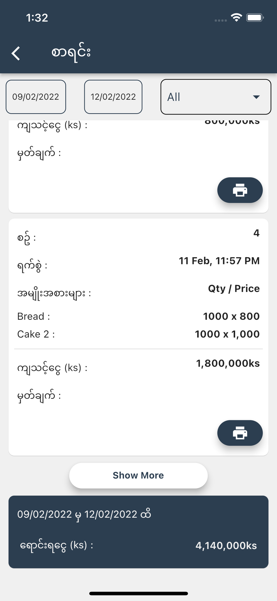
- Setting (Phone Size)
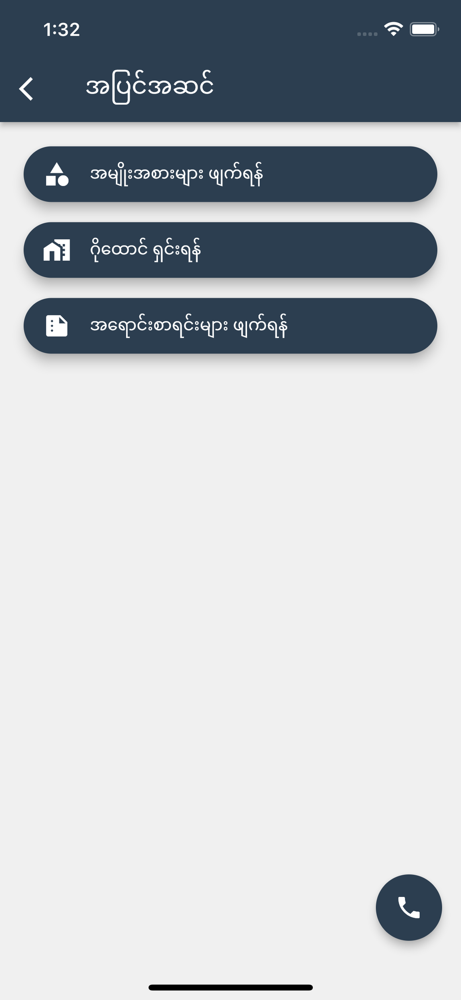

# Thanks for visiting :P